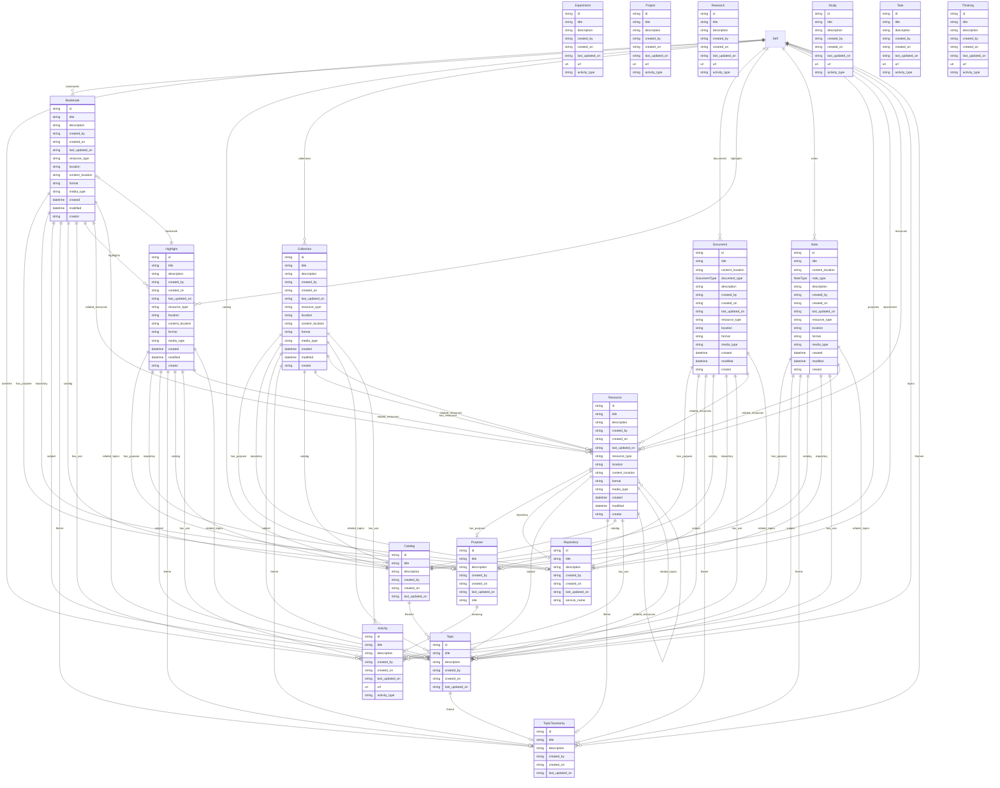

```mermaid
erDiagram
Activity {
    string id  
    string title  
    string description  
    string created_by  
    string created_on  
    string last_updated_on  
    uri url  
    string activity_type  
}
Bookmark {
    string id  
    string title  
    string description  
    string created_by  
    string created_on  
    string last_updated_on  
    string resource_type  
    string location  
    string content_location  
    string format  
    string media_type  
    datetime created  
    datetime modified  
    string creator  
}
Catalog {
    string id  
    string title  
    string description  
    string created_by  
    string created_on  
    string last_updated_on  
}
Collection {
    string id  
    string title  
    string description  
    string created_by  
    string created_on  
    string last_updated_on  
    string resource_type  
    string location  
    string content_location  
    string format  
    string media_type  
    datetime created  
    datetime modified  
    string creator  
}
Document {
    string id  
    string title  
    string content_location  
    DocumentType document_type  
    string description  
    string created_by  
    string created_on  
    string last_updated_on  
    string resource_type  
    string location  
    string format  
    string media_type  
    datetime created  
    datetime modified  
    string creator  
}
Experiment {
    string id  
    string title  
    string description  
    string created_by  
    string created_on  
    string last_updated_on  
    uri url  
    string activity_type  
}
Highlight {
    string id  
    string title  
    string description  
    string created_by  
    string created_on  
    string last_updated_on  
    string resource_type  
    string location  
    string content_location  
    string format  
    string media_type  
    datetime created  
    datetime modified  
    string creator  
}
Note {
    string id  
    string title  
    string content_location  
    NoteType note_type  
    string description  
    string created_by  
    string created_on  
    string last_updated_on  
    string resource_type  
    string location  
    string format  
    string media_type  
    datetime created  
    datetime modified  
    string creator  
}
Project {
    string id  
    string title  
    string description  
    string created_by  
    string created_on  
    string last_updated_on  
    uri url  
    string activity_type  
}
Purpose {
    string id  
    string title  
    string description  
    string created_by  
    string created_on  
    string last_updated_on  
    string role  
}
Repository {
    string id  
    string title  
    string description  
    string created_by  
    string created_on  
    string last_updated_on  
    string service_name  
}
Research {
    string id  
    string title  
    string description  
    string created_by  
    string created_on  
    string last_updated_on  
    uri url  
    string activity_type  
}
Resource {
    string id  
    string title  
    string description  
    string created_by  
    string created_on  
    string last_updated_on  
    string resource_type  
    string location  
    string content_location  
    string format  
    string media_type  
    datetime created  
    datetime modified  
    string creator  
}
Self {

}
Study {
    string id  
    string title  
    string description  
    string created_by  
    string created_on  
    string last_updated_on  
    uri url  
    string activity_type  
}
Task {
    string id  
    string title  
    string description  
    string created_by  
    string created_on  
    string last_updated_on  
    uri url  
    string activity_type  
}
Thinking {
    string id  
    string title  
    string description  
    string created_by  
    string created_on  
    string last_updated_on  
    uri url  
    string activity_type  
}
Topic {
    string id  
    string title  
    string description  
    string created_by  
    string created_on  
    string last_updated_on  
}
TopicTaxonomy {
    string id  
    string title  
    string description  
    string created_by  
    string created_on  
    string last_updated_on  
}

Bookmark ||--|o Purpose : "has_purpose"
Bookmark ||--|o Repository : "repository"
Bookmark ||--|o Topic : "subject"
Bookmark ||--|o TopicTaxonomy : "theme"
Bookmark ||--|| Catalog : "catalog"
Bookmark ||--}o Activity : "has_use"
Bookmark ||--}o Highlight : "highlights"
Bookmark ||--}o Resource : "related_resources"
Bookmark ||--}o Topic : "related_topics"
Catalog ||--}o Topic : "themes"
Collection ||--|o Purpose : "has_purpose"
Collection ||--|o Repository : "repository"
Collection ||--|o Topic : "subject"
Collection ||--|o TopicTaxonomy : "theme"
Collection ||--|| Catalog : "catalog"
Collection ||--}o Resource : "has_resources"
Collection ||--}o Resource : "related_resources"
Collection ||--}o Topic : "related_topics"
Collection ||--}| Activity : "has_use"
Document ||--|o Purpose : "has_purpose"
Document ||--|o Topic : "subject"
Document ||--|o TopicTaxonomy : "theme"
Document ||--|| Catalog : "catalog"
Document ||--|| Repository : "repository"
Document ||--}o Activity : "has_use"
Document ||--}o Resource : "related_resources"
Document ||--}o Topic : "related_topics"
Highlight ||--|o Bookmark : "bookmark"
Highlight ||--|o Purpose : "has_purpose"
Highlight ||--|o Repository : "repository"
Highlight ||--|o Topic : "subject"
Highlight ||--|o TopicTaxonomy : "theme"
Highlight ||--|| Catalog : "catalog"
Highlight ||--}o Activity : "has_use"
Highlight ||--}o Resource : "related_resources"
Highlight ||--}o Topic : "related_topics"
Note ||--|o Purpose : "has_purpose"
Note ||--|o Topic : "subject"
Note ||--|o TopicTaxonomy : "theme"
Note ||--|| Catalog : "catalog"
Note ||--|| Repository : "repository"
Note ||--}o Activity : "has_use"
Note ||--}o Resource : "related_resources"
Note ||--}o Topic : "related_topics"
Purpose ||--|o Activity : "meaning"
Resource ||--|o Purpose : "has_purpose"
Resource ||--|o Repository : "repository"
Resource ||--|o Topic : "subject"
Resource ||--|o TopicTaxonomy : "theme"
Resource ||--|| Catalog : "catalog"
Resource ||--}o Activity : "has_use"
Resource ||--}o Resource : "related_resources"
Resource ||--}o Topic : "related_topics"
Self ||--}o Activity : "activities"
Self ||--}o Bookmark : "bookmarks"
Self ||--}o Catalog : "catalog"
Self ||--}o Collection : "collections"
Self ||--}o Document : "documents"
Self ||--}o Highlight : "highlights"
Self ||--}o Note : "notes"
Self ||--}o Purpose : "purposes"
Self ||--}o Repository : "repositories"
Self ||--}o Resource : "resources"
Self ||--}o Topic : "topics"
Self ||--}o TopicTaxonomy : "themes"
Topic ||--|o TopicTaxonomy : "theme"

```

