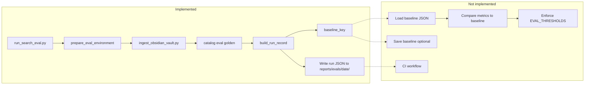

# Search Eval Harness – Implementation Status (Backlog)

The search eval harness from the implementation plan is largely implemented: Phase 1 (harness script) and Phase 2 (run record) are complete, with tests. Phase 3 (baseline comparison and threshold enforcement) and Phase 4 (CI) are missing or partial.

---

## Summary

**Partially implemented.** The core harness script, run record schema, corpus hashing, baseline key, and tests are in place. Baseline *comparison* (load baseline, diff metrics, enforce `EVAL_THRESHOLDS`) and CI integration are **not** implemented.

---

## What Exists

### Phase 1: Harness Script – **Done**

- `scripts/run_search_eval.py`: Accepts corpus, queries-file, output-dir, dataset-name, embedding-model, catalog/content/vector paths, `--compare-baseline`, repo-root. Sets env (`SUBSTRATE_DATABASES__CATALOG_PATH`, etc.), runs `scripts/ingest_obsidian_vault.py`, then `uv run python -m catalog eval golden --queries-file <file> --output json`. Builds run record and writes to `reports/evals/YYYY-MM-DD/<timestamp>.json`.

### Phase 2: Run Record Envelope – **Done**

- `src/catalog/catalog/eval/harness.py`: `build_run_record()` produces JSON with `run_id`, `git.commit`/`branch`/`dirty`, `corpus.path`/`hash`, `queries.path`/`version`, `settings.embedding_model`/`fts_impl`/`rag_v2` (chunk_size, chunk_overlap, rrf_k, rerank_enabled, expansion_enabled), and `metrics`. Corpus hash and query version logic are implemented.

### Phase 3: Baseline Management – **Partial**

- **Done:** `baseline_key(run_record)` builds a key from corpus hash, queries version, embedding model, fts_impl, and RAG v2 settings. Baseline path is `reports/evals/baselines/<key>.json`.
- **Done:** `--compare-baseline` causes non-zero exit only when the baseline **file is missing** (no comparison of metrics).
- **Missing:**
  - Loading the baseline JSON and comparing current run metrics (e.g. hit@k per retriever/difficulty) to it.
  - Enforcing `EVAL_THRESHOLDS` (see `catalog.eval.golden`) or configurable thresholds when comparing to baseline; the CLI has `--check` for thresholds only when running `catalog eval golden` directly, not in the harness.
  - No `--save-baseline` (or equivalent) to write the current run record to `reports/evals/baselines/<key>.json`.

### Phase 4: CI Integration – **Not done**

- No GitHub Actions (or other CI) workflow in this repo that runs the eval harness, stores the run record as an artifact, or fails on threshold regressions. Workflows under `src/advanced-alchemy/.github/workflows/` are for a different subproject.

### Testing – **Partial**

- `src/catalog/tests/rag_v2/test_eval_harness.py`: Covers `compute_corpus_hash`, `read_queries_version`, `read_eval_metrics`, `build_run_record`, and `baseline_key` determinism.
- **Missing (per plan):** Unit tests for baseline comparison logic and threshold enforcement.

### Optional / Not done

- Human summary file (`reports/evals/YYYY-MM-DD/summary.txt`) with query counts, hit@k table, and baseline comparison is not generated.

---

## Gaps to Close (full plan compliance)

1. **Baseline comparison and thresholds (Phase 3)**  
   In the harness (or script): load baseline from `reports/evals/baselines/<key>.json` when `--compare-baseline` is set; compare current `metrics` to baseline (e.g. hit@1/3/5/10 by retriever/difficulty); enforce `EVAL_THRESHOLDS` (or allow override); exit non-zero on regression. Optionally add `--save-baseline` to write current run to that path.

2. **CI job (Phase 4)**  
   Add a workflow (e.g. under `.github/workflows/` at repo root) that runs the harness with pinned corpus/queries paths, publishes the run record as an artifact, and fails when thresholds are not met (using the comparison above).

3. **Tests**  
   Add unit tests for the new baseline-comparison and threshold-enforcement behavior.

4. **Summary output (optional)**  
   Add generation of `summary.txt` alongside the run record JSON as in the plan.

---

## Diagram (current vs plan)

