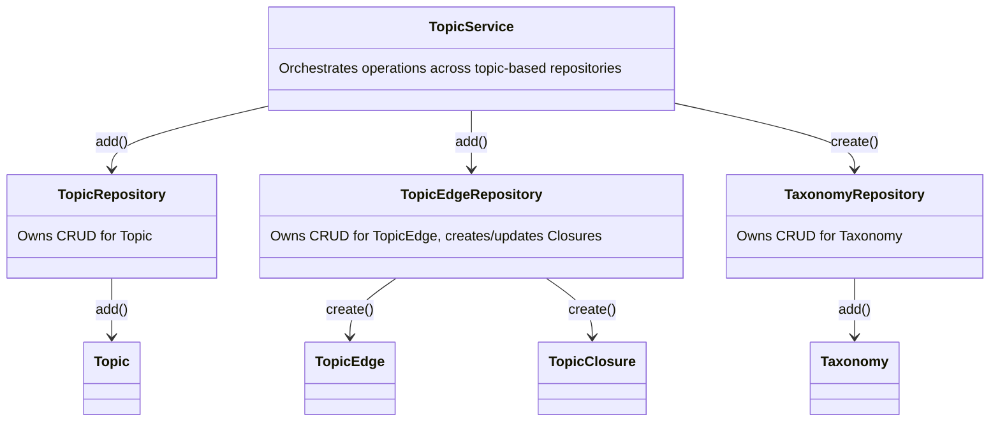

# LifeOS Ontology
This is the python library responsible for maintaining the core LifeOS Ontology. The ontology itself is described in [the documentation](./docs/LifeOS_Ontology.md).

## Purpose
1. Model the ontology of the life business, permitting structured and semantically [TODO] representations of elements of interest
2. Allow storage and retrieval of these elements to support various use cases

## Data Access
The Service layer provides business logic and orchestrates operations across repositories.



## Structure

```
├── api/
│   ├── FastAPI endpoints
├── cli/
│   ├── Typer CLI
├── database/
│   ├── SQLAlchemy models and data access layer
├── domain/
│   ├── LinkML schema and generated representations
│   ├── schema/*.yaml
│   ├── linkml.py (renameme)
├── graph/
├── loader/
│   ├── Conversion of external data formats to our schema
├── models/
│   ├── Core domain models
│   ├── `attrs` classes
├── repositories/
│   ├── Data repository classes for aggregates and entities
│   ├── advanced_alchemy.repository.SQLAlchemyAsyncRepository classes
├── schema/
│   ├── Pydantic commands & DTOs (I/O only)
├── services/
│   ├── Commands and Queries that cross domain boundaries
│   ├── advanced_alchemy.service.SQLAlchemyAsyncRepositoryService classes
├── utils/


```


## Design

## Architecture
### Domain modeling
Domain entities are modeled using `LinkML`; this facilitates interoperability with RDFLib and other libraries (given it can serialize to many types of triple stores and ontology formats):
- [LinkML Documentation - linkml_runtime.loaders.rdflib_loader](https://linkml.io/linkml/_modules/linkml_runtime/loaders/rdflib_loader.html)
- [LinkML Documentation - linkml_runtime.dumpers.rdflib_dumper](https://linkml.io/linkml/_modules/linkml_runtime/dumpers/rdflib_dumper.html)

#### LinkML
- LinkML definitions cab be used for serialization to and from `RDFLib` graphs
- `LinkML` definitions can be used for inbound claassification via `OntoGPT` (or CurateGPT and Aurelian)


## Modules
This library contains various submodules, including:
1. Domains (`ontology.domains`)

### Ontology.Domains
This submodule is responsible for the modeling of the various domains in the LifeOS Ontology, and is described in detail in [the module README]('./domains/README.md')

## Files
### Topics
Topic entities are managed using `topics.py`, which handles calling into the individual domains in the `ontology.domains` module.
#### JSON input format
This is pseudo-[JSON-LD](https://ontola.io/blog/rdf-serialization-formats#:~:text=JSON%2DLD,-\(.jsonld)

The `@context` is part of JSON-LD/RDF, and the rest is modeling for our `owlready2` classes to ingest.

#### JSON-LD Notes

> “No extra processors or software libraries are necessary to use JSON‑LD in its most basic form. The language provides developers with a very easy learning curve. Developers not concerned with Linked Data only need to understand JSON, and know to include but ignore the @context property, to use the basic functionality in JSON‑LD.”
>
> — World Wide Web Consortium. (2014). JSON‑LD 1.0.

> JSON-LD specifies a number of syntax tokens and keywords that are a core part of the language which add additional semantic meaning and bring it closer to RDF, such as:
>
> @context defines the vocabulary and meaning of terms
> @id provides a unique identifier (URI) for an entity
> @type specifies the entity’s classification within that vocabulary (e.g., schema:Product).

[source: RDF and Schema Markup](https://www.schemaapp.com/schema-markup/rdf-and-schema-markup-the-power-of-relationships-in-the-age-of-intelligent-systems/)

> If you're not already familiar with the JSON-LD @context keyword, it effectively allows you to define a set of terms that can be used in place of full IRIs. For example, instead of using http://www.w3.org/1999/02/22-rdf-syntax-ns#Property you can use rdf:Property (where rdf is defined in your @context).

[source: Working with Context (Fluree)](https://next.developers.flur.ee/docs/learn/guides/working-with-context/)

#### Example (current state)
```json
{
    "@context": {
        "schema": "https://schema.org/",
        "skos": "http://www.w3.org/2004/02/skos/core#",
        "cso": "https://cso.kmi.open.ac.uk/topics/",
        "unspsc": "https://www.unspsc.org/",
        "lcsh": "http://id.loc.gov/authorities/subjects/"
    },
    "topic": {
        "name": "HomeAssistant",
        "classification": "Topic",
        "ontologies": [
            {
                "system": "CSO",
                "identifier": "home_automation_software",
                "confidence": 0.95
            },
            {
                "system": "WIKIDATA",
                "identifier": "Q28957018",
                "confidence": 1.0
            }
        ]
    }
}
```
